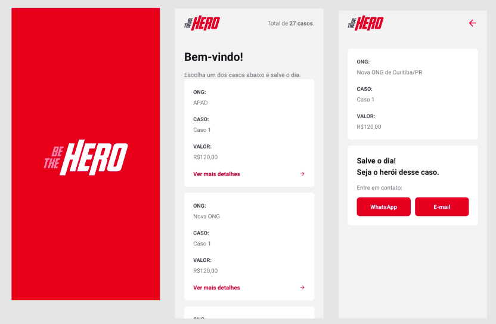

<h4 align="center">
<br>
</h4>
<p align="center">
     
     
  <a href="https://rocketseat.com.br">
    
  </a>
    
</p>
<p align="center">
  <br>
</p>

Semana Omnistack 11,  ministrada por [Diego Fernandes](https://github.com/diego3g) :mortar_board:

Feito com 💜 by Rocketseat :wave: [Entre na nossa comunidade!](https://discordapp.com/invite/gCRAFhc)

### Pré-requisitos
Antes de começar, verifique se possui os seguintes requisitos:
* Possui a versão 12.x do [NodeJS](https://nodejs.org/en/download/)
* Possui o [Yarn](https://classic.yarnpkg.com/en/docs/install) na versão 1.x ou NPM.

### Instalando o projeto
Para instalar as dependências, execute nas pastas de backend, frontend e mobile:

```
yarn install
```

### Utilizando o projeto

Faça as seguintes etapas:

Para o backend, em sua respectiva pasta, execute:
```
yarn start
```
Para o frontend, em sua respectiva pasta, execute:
```
yarn start
```
Para o mobile, em sua respectiva pasta, execute:
```
yarn start
yarn android
# ou se estiver utilizando iOS
yarn ios
```
### Contribuir com o projeto
Para contribuir com o "be-the-hero", siga esses passos:

1. "Fork" esse repositório.
2. Crie uma branch: `git checkout -b <branch_name>`.
3. Faça suas alterações e "commit": `git commit -m '<commit_message>'`
4. "Push" para a branch original: `git push origin <project_name>/<location>`
5. Crie uma "pull request".

Você também pode visitar a documentação do GitHub em [Criar uma pull request](https://help.github.com/pt/github/collaborating-with-issues-and-pull-requests/creating-a-pull-request).
